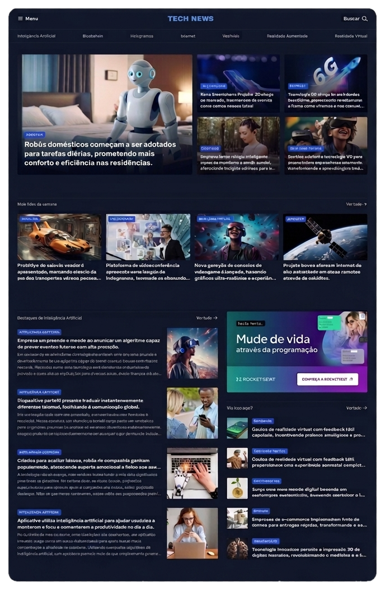

# Projeto - Tech News 🚀

> Um portal de notícias sobre tecnologia desenvolvido com foco em organização de layout utilizando **CSS Grid Display**.

---

## 📸 Mockup do Projeto

  

---

## 🛠️ Tecnologias Utilizadas

* **HTML5** – Estruturação semântica do portal.
* **CSS3** – Estilização e responsividade.
* **CSS Grid** – Utilizado como base principal para a construção do layout de notícias.

---
Desenvolvido por [Kaique Ricci](https://github.com/kaiqueRicci).